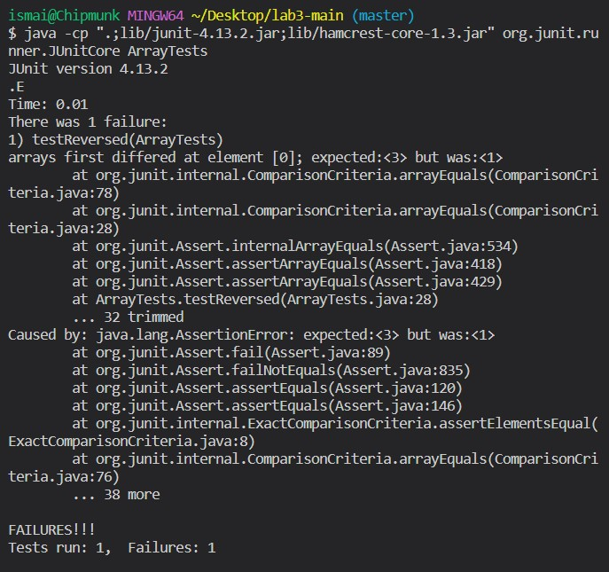
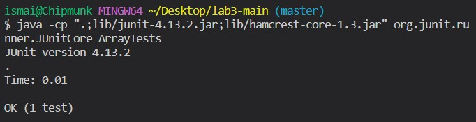

# Part 1

Following is the Java code for a web server that keeps track of a single string that gets added to by incoming requests. The code is based on the files provided in the  [wavelet repository](https://github.com/ucsd-cse15l-f22/wavelet) used for Lab 3. In `StringServer.java`, the class `Handler` implements interface `URLHandler` implemented in `Server.java`. Additionally, the class `StringServer` makes a call to a static method provided in `Server.java`.

## StringServer.java

```
import java.io.IOException;
import java.net.URI;

class Handler implements URLHandler {
    public String conversation = "";

    public String handleRequest(URI url) {
        if (url.getPath().equals("/add-message")) {
            String[] parameters = url.getQuery().split("=");
            if (parameters[0].equals("s") &&
                    parameters[1] instanceof String) {
                conversation+= (parameters[1] + '\n');
                return conversation;
            }
        }
        return "Try a url of the following format: \"/add-message?s=<string>\"";
    }
}

class StringServer {
    public static void main(String[] args) throws IOException {
        if(args.length == 0){
            System.out.println("Missing port number!");
            return;
        }
        int port = Integer.parseInt(args[0]);
        Server.start(port, new Handler());
    }
}
```
Below is the screenshot of the first URL request. The following methods from `StringServer.java` are called:
- `StringServer.main` with argument `999`.
- `Handler.handleRequest` with argument `localhost:999/add-message?s=IsThisWorking???`.
- The value of data field `conversation` changes from `""` to `"IsThisWorking???\n"`.

|  | 
|:--:| 
| *Screenshot of first URL request* 

Below is the screenshot of the secpnd URL request. The following methods from `StringServer.java` are called:
- `Handler.handleRequest` with argument `localhost:999/add-message?s=OfCOurseThisIsWorking!`.
- The value of data field `conversation` changes from `"IsThisWorking???\n"` to `"IsThisWorking???\nOfCOurseThisIsWorking!\n"`.

|  | 
|:--:| 
| *Screenshot of second URL request* 

# Part 2

Debugging method `reversed(int[] arr)` from `ArrayExamples.java`.

## Failuring-inducing input

```
@Test
public void testReversed() {
    int[] input1 = { 1 , 3 };
    assertArrayEquals(new int[]{ 3, 1 }, ArrayExamples.reversed(input1));
}
```

## Non-failuring-inducing input

```
@Test
public void testReversed2() {
    int[] input1 = { 1 };
    assertArrayEquals(new int[]{ 1 }, ArrayExamples.reversed(input1));
}
```

## Symptom

|  | 
|:--:| 
| *Running JUnit test __with__ failure-inducing input* 

|  | 
|:--:| 
| *Running JUnit test __without__ failure-inducing input* 

## Buggy Code

```
static int[] reversed(int[] arr) {
    int[] newArray = new int[arr.length];
    for(int i = 0; i < arr.length; i += 1) {
        arr[i] = newArray[arr.length - i - 1];
    }
    return arr;
}
```

## Fixed Code

```
static int[] reversed(int[] arr) {
    int[] newArray = new int[arr.length];
    for(int i = 0; i < arr.length; i += 1) {
        newArray[i] = arr[arr.length - i - 1];
    }
    return arr;
}
```

The method required a very simple fix. The buggy code assigns values to the wrong array `arr[]` instead of `newArray[]`. Swapping them around fixes the bug and the method works as expected.

# Part 3

In Lab 2, I learned how to deploy a web server locally (localhost). It was very interesting to learn the elementary blocks behind a web server's design. For example, I never closely examined the URL a user is transferred to after a simple Google search. After learning and implementing a simple search engine, I realized that the url itself includes pieces of information as multiple queries arranged after an `?` sign. This helped me gain better intuition and a surface-level understanding of youtube and google search URLs.
