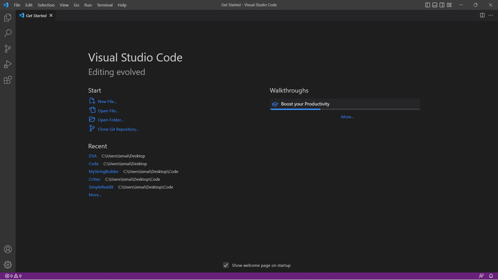
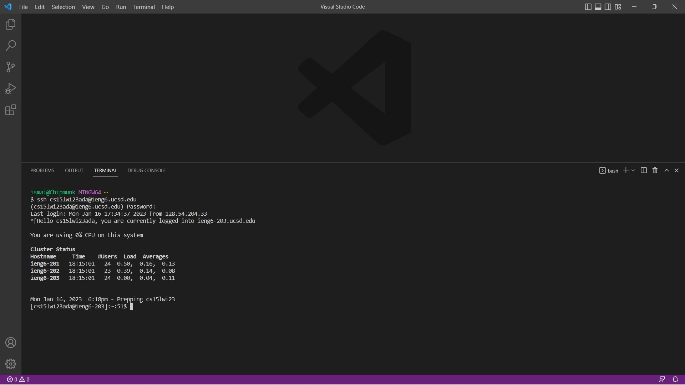
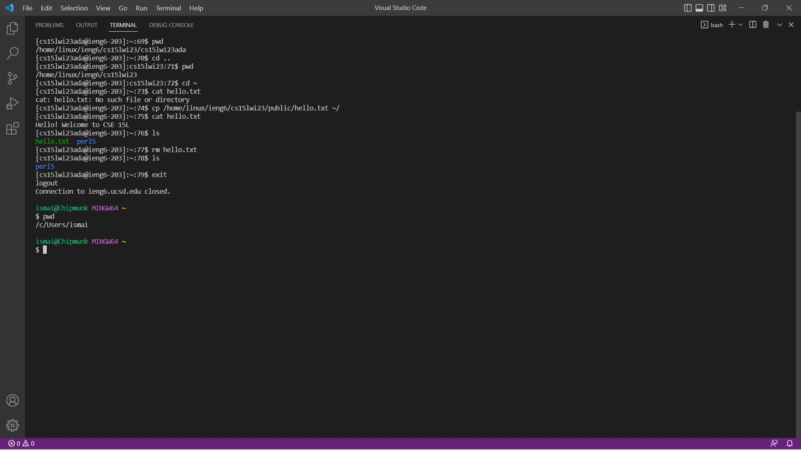

# Part 1

## StringServer.java

```
import java.io.IOException;
import java.net.URI;

class Handler implements URLHandler {
    public String conversation = "";

    public String handleRequest(URI url) {
        if (url.getPath().equals("/add-message")) {
            String[] parameters = url.getQuery().split("=");
            if (parameters[0].equals("s") &&
                    parameters[1] instanceof String) {
                conversation+= (parameters[1] + '\n');
                return conversation;
            }
        }
        return "Try a url of the following format: \"/add-message?s=<string>\"";
    }
}

class StringServer {
    public static void main(String[] args) throws IOException {
        if(args.length == 0){
            System.out.println("Missing port number!");
            return;
        }
        int port = Integer.parseInt(args[0]);
        Server.start(port, new Handler());
    }
}
```


Installing VScode on your machine should be relatively straightforward. 

First, go to the Visual Studio Code [website](https://code.visualstudio.com/), and follow the instructions. There are versions for all the major operating systems, like OSX (for Macs) and Windows (for PCs). Make sure you download and install the correct version for your system. Follow the installation instructions and select the desired configuration. The default settings should work just well.

Second? Oh there is no second—you are good to go!



---

# Part 2

This could be the hardest part of the lab exercise, but, nevertheless, is pretty straightforward.

If you are a windows user, then you have an additional step before you can proceed. Install [Git for Windows](https://gitforwindows.org/) and set your default terminal to use the newly installed git bash in Visual Studio Code. To do the latter, you can make use of this post on [Stack Overflow](https://stackoverflow.com/questions/42606837/how-do-i-use-bash-on-windows-from-the-visual-studio-code-integrated-terminal/50527994#50527994). You are all ready now.

* Head to the following [Link](https://sdacs.ucsd.edu/~icc/index.php) to find your course-specific account. It should start with "cs15l" followed by a small alphanumeric code. If you are unable to do this, then you may need to reset your password. This is common and will take a couple minutes. Follow this very detailed [tutorial](https://docs.google.com/document/d/1hs7CyQeh-MdUfM9uv99i8tqfneos6Y8bDU0uhn1wqho/edit) on how to do it correctly.
* Replace "zz" with the letters in your course-specific account in the following: `ssh cs15lwi23<ins>zz</ins>@ieng6.ucsd.edu`. Then enter the resulting command in your bash terminal.
* You will probably see a series of messages ending with a (yes/no/fingerprint) question. Answer it with "yes".
* Now, you will be prompted to enter your password. Enter your Student SSO password to receive authentication. (When you type your password it might seem that the terminal is not receiving anything. However, this is not the case. The characters you enter are simply not made visible for your security.)

And that's it! Your terminal is remotely connected to a UCSD server.



---

# Part 3

You are now ready to run some commands and explore the remote client-server setup.

* Enter `pwd` to check your current working directory
* Enter `cd ..` to change your directory to the immediate parent. Entering `pwd` will now give another working directory.
* Enter `cd ~` to return back to your home directory.
* Try `cat hello.txt`. This will give you an error as you don't have any file named "hello.txt" in your current folder.
* Now, type `cp /home/linux/ieng6/cs15lwi23/public/hello.txt ~/` to copy the "hello.txt" already provided publicly in another folder to your own current folder.
* Trying `cat hello.txt` will now work and show you its contents.
* Entering `ls` to view the list of files and folders in your current directory will also show you the recently copied "hello.txt".
* You can enter `rm hello.txt` to remove it. Check the list of files again using `ls` to see if it is still in your current directory. 
* Type `exit` to log out of the remote server.
* Try `pwd` again to notice your working directory change back to your local computer.
* Finally, hold Ctrl-L to clear the terminal! 



---
