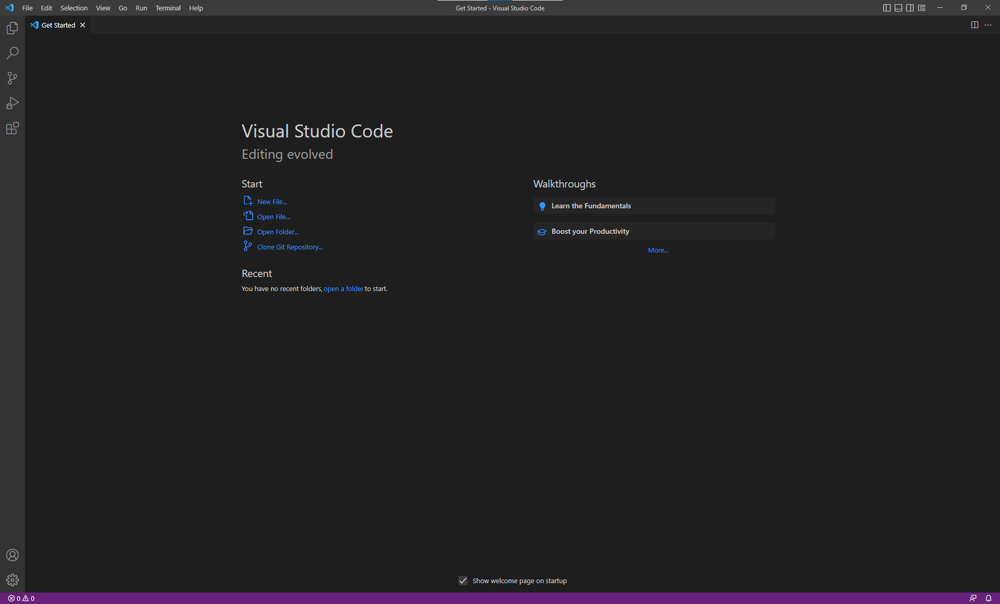
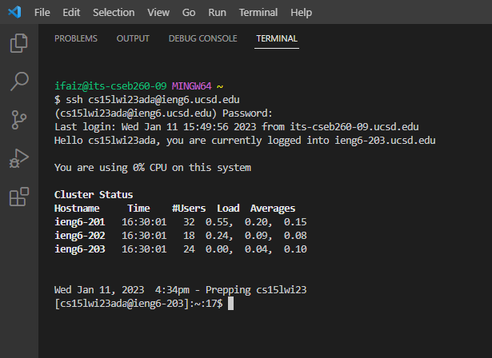
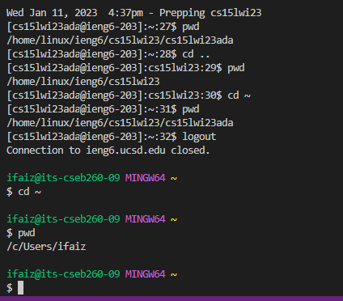

## Installing VScode

Installing VScode on your machine should be relatively straightforward. 

First, go to the Visual Studio Code [website](https://code.visualstudio.com/), and follow the instructions. There are versions for all the major operating systems, like OSX (for Macs) and Windows (for PCs). Make sure you download and install the correct version for ypour system. Follow the installation instructions and select the desired configuration. The default settings should work just well.

Second? Oh there is no second—you are good to go!

---

## Remotely Connecting

Now. to remotely connect to the 

---

## Trying Some Commands

---
