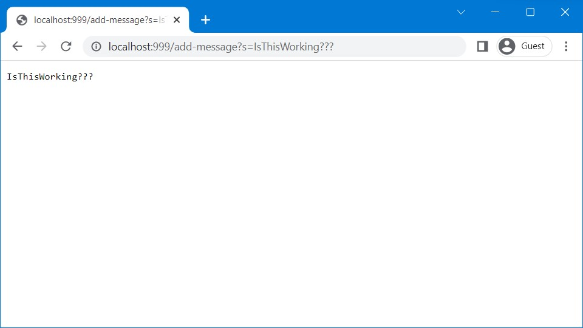
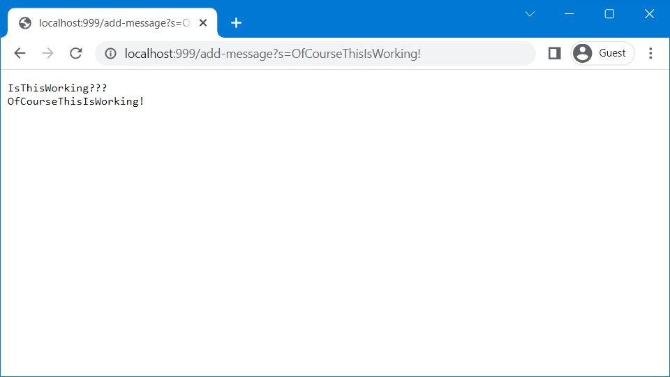

# Part 1

Following is the Java code for a web server that keeps track of a single string that gets added to by incoming requests. The code is based on the files provided in the  [wavelet repository](https://github.com/ucsd-cse15l-f22/wavelet) used for Lab 3. In `StringServer.java`, the class `Handler` implements interface `URLHandler` implemented in `Server.java`. Additionally, the class `StringServer` makes a call to a static method provided in `Server.java`.

## StringServer.java

```
import java.io.IOException;
import java.net.URI;

class Handler implements URLHandler {
    public String conversation = "";

    public String handleRequest(URI url) {
        if (url.getPath().equals("/add-message")) {
            String[] parameters = url.getQuery().split("=");
            if (parameters[0].equals("s") &&
                    parameters[1] instanceof String) {
                conversation+= (parameters[1] + '\n');
                return conversation;
            }
        }
        return "Try a url of the following format: \"/add-message?s=<string>\"";
    }
}

class StringServer {
    public static void main(String[] args) throws IOException {
        if(args.length == 0){
            System.out.println("Missing port number!");
            return;
        }
        int port = Integer.parseInt(args[0]);
        Server.start(port, new Handler());
    }
}
```


|  | 
|:--:| 
| *Caption?* 




# Part 2

# Part 3
