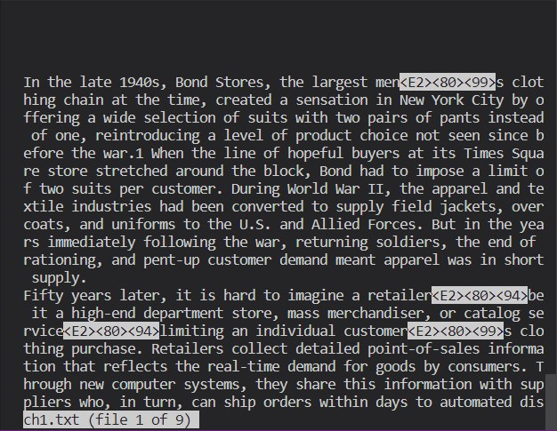
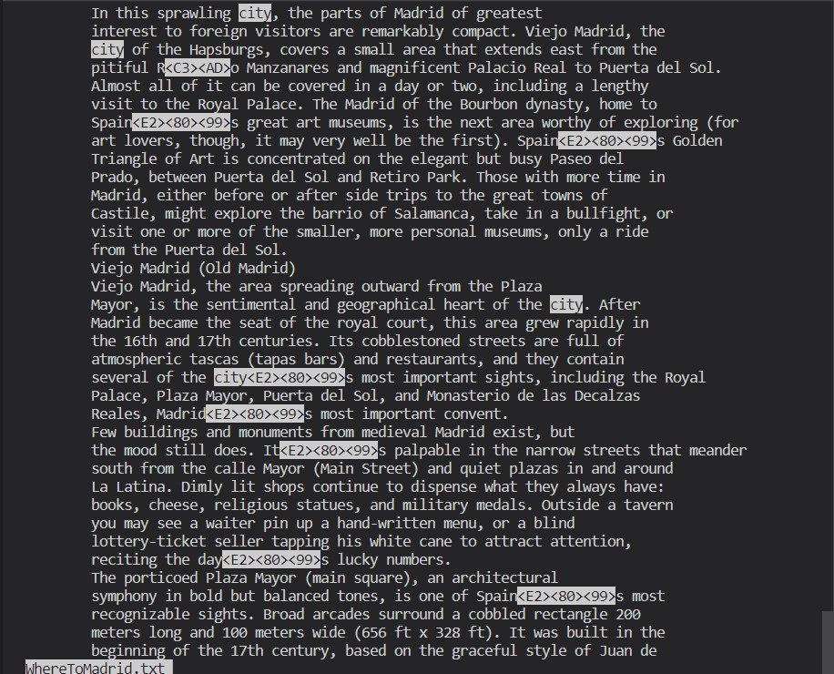
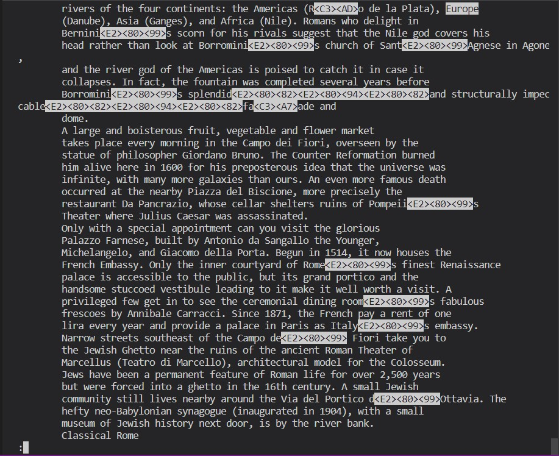
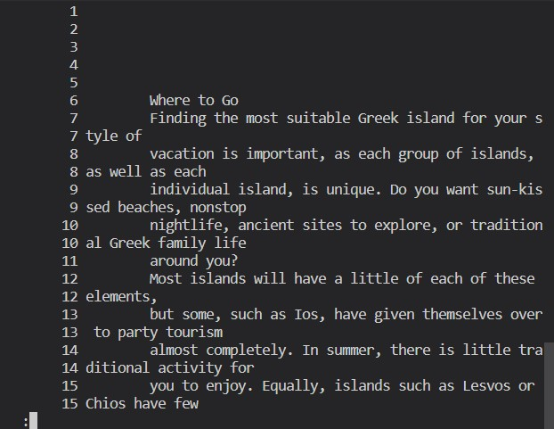
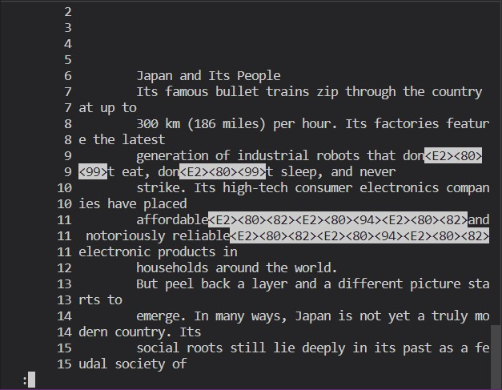
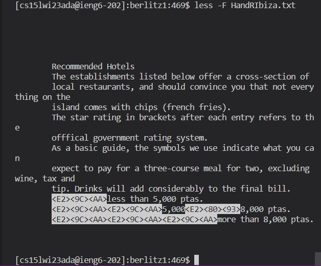
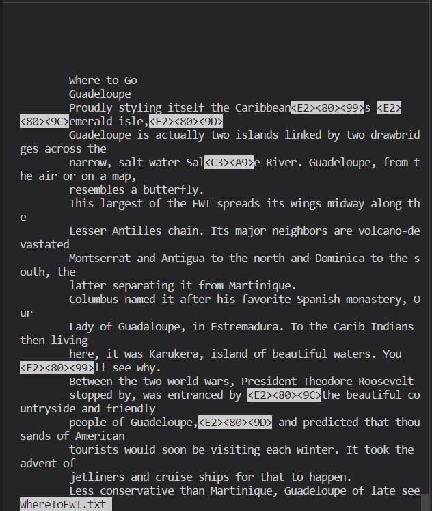

# Four ways to use the `less` command

In this lab report, I will be exploring the `less` command in 

. In addition to using the `man` command to access bash's reference manual, I have used the following two links: [[1]](https://www.geeksforgeeks.org/less-command-linux-examples/) and [[2]](https://www.thegeekstuff.com/2010/02/unix-less-command-10-tips-for-effective-navigation/).

## 1. `less *` and `:n`, `:p`

The first functionality we explore is the multiple file navigation. This could be useful when we wnat to have a look at more than one file in a directory without having to write a command for each of them. Following is a sample code snippet that helps achieve this:

```
less written_2/non-fiction/OUP/Abernathy/*
```

Now, `less` command allows us to enter `:n` to go to the next file and `:p` to go to the previous file. The first example shows the bash interface for the former while the second example shows the bash interface for the latter.

|  | 
|:--:| 
| *First example*

|  | 
|:--:| 
| *Second example*

## 2. `less -p <pattern>`

The second option we explore highlights all instances of a given pattern and starts display at the first occurrence of the pattern in the file. This could be helpful when we are only interested in a file from the first appearance of a particular pattern. In the first example, we search the file WhereToMadrid.txt for the string "city":

```
less -p /written_2/travel_guides/berlitz1/WhereToMadrid.txt
```

|  | 
|:--:| 
| *First example*

The command below tells `less` to start at the first occurrence of pattern "Europe" in the file WhereToItaly.txt:

```
less -p /written_2/travel_guides/berlitz1/WhereToMadrid.txt
```

The second example below shows the bash interface for the above command.

|  | 
|:--:| 
| *Second example*

## 3. `less -N`

Sometimes, we may want to view a file from the command line such that each line is accompanied with its corresponding line number. This can be achieved using the `-N` option. The first example displays the file WhereToGreek.txt with line numbers while the second example does the same for the file IntroJapan.txt.

First example:

```
less -N /written_2/travel_guides/berlitz1/WhereToGreek.txt
```

|  | 
|:--:| 
| *First example*

Second example:

```
less -N /written_2/travel_guides/berlitz1/IntroJapan.txt
```

|  | 
|:--:| 
| *Second example*

## 4. `less -F`

The final option that we are going to look at is the `-F` option. This option causes `less` to exit if the given file to be displayed can be displayed on the first page/screen. This saves us one additional command to leave the `less` interface if the file is small enough. The first example shows us a case where the file is small enough to be displayed on a single page. So, here, the `-F` option causes `less` to exit. In the second example, the file takes up more lines than can be displayed in the first screen. So, here, the `less` command functions as usual.

First example:

```
less -F /written_2/travel_guides/berlitz1/WhereToGreek.txt
```

|  | 
|:--:| 
| *First example*


Second example:

```
less -F /written_2/travel_guides/berlitz1/IntroJapan.txt
```

|  | 
|:--:| 
| *Second example*
