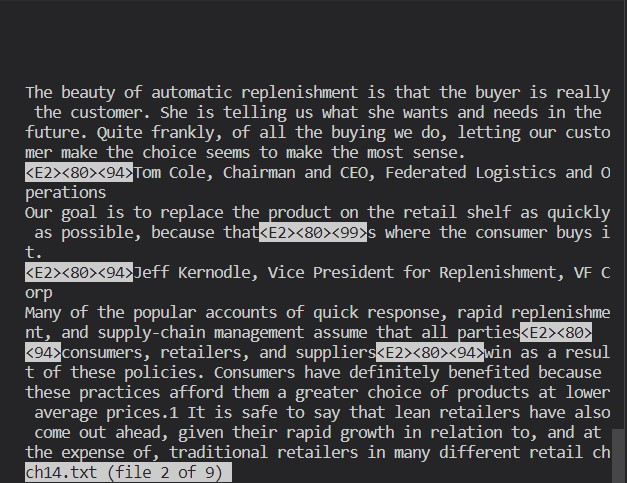

# Four ways to use the `less` command

## 1. `less *` and `:n`, `:p`

|  | 
|:--:| 
| *First example*

|  | 
|:--:| 
| *Second example*

## `less -p <pattern>`

|  | 
|:--:| 
| *First example*

|  | 
|:--:| 
| *Second example*
## 3. `less -N`

|  | 
|:--:| 
| *First example*

|  | 
|:--:| 
| *Second example*

## 4. `less =F`

|  | 
|:--:| 
| *First example*

|  | 
|:--:| 
| *Second example*
