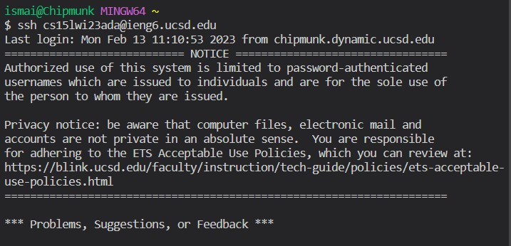
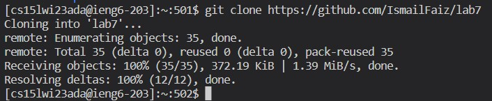
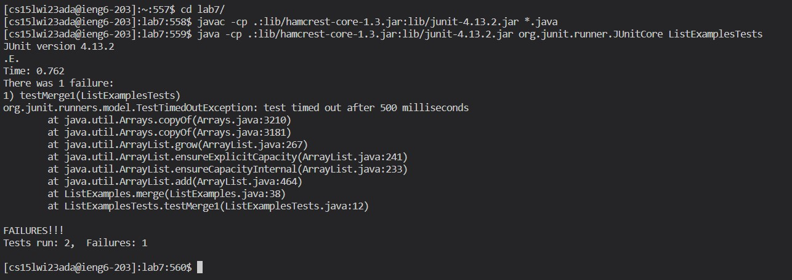
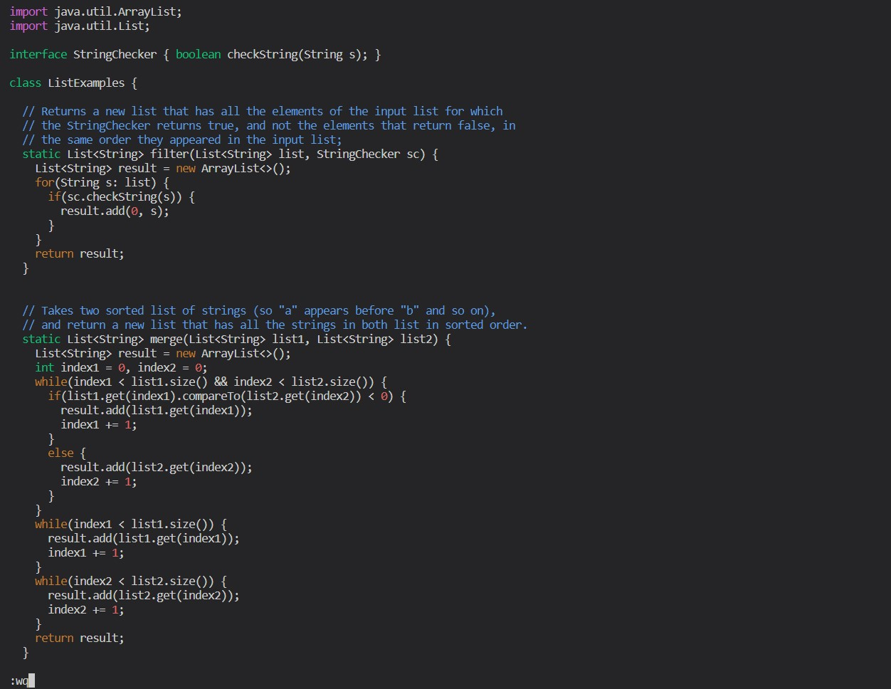
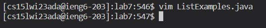
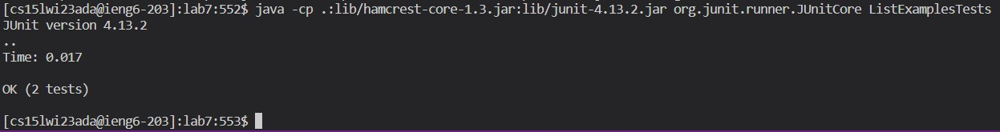
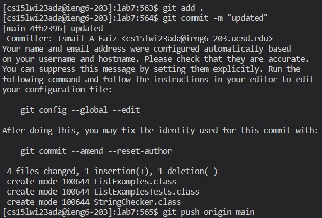

Before proceeding with step 4, make sure that you have already completed steps 1-3. If not, you can read them on the course's [[github write-up]](https://ucsd-cse15l-w23.github.io/week/week7/).

## Step 4

- `ssh cs15lwi23ada@ieng6.ucsd.edu <enter>` : this establishes the remote connection.

|  | 
|:--:| 
| *Step 4*

## Step 5

- `git clone <ctrl+V><enter>` : here, I already had the https link to the Githib repository copied in my clipboard so I simply pasted it to clone it to the remote account.

|  | 
|:--:| 
| *Step 5*

## Step 6

- `cd l<tab> <enter>` : change directory into `lab7/`.
- `javac -cp .:lib/hamcrest-core-1.3.jar:lib/junit-4.13.2.jar *.java <enter>` : compile all the Java files in the directory.
- `java -cp .:lib/hamcrest-core-1.3.jar:lib/junit-4.13.2.jar org.junit.runner.JUnitCore ListExamplesTest <enter>` : run the JUnit test file.

|  | 
|:--:| 
| *Step 6*

## Step 7

- `vim Li<tab>.java<enter>` : enter vim text editor to edit the code file to fix the bug.
- Move around the file using the `<up>` and `<down>` keys and make the required changes using `<insert>` and `<delete>` keys. When done, press `<esc>` and then type `wq` to save and quit.

|  | 
|  | 
|:--:| 
| *Step 7*

## Step 8

- `<up><up><up><enter>` : this retrieves the command to compile from history.
- `<up><up><up><enter>` : this retrieves the command to run the JUnit test file from history.

|  | 
|:--:| 
| *Step 8*

## Step 9

- `git add .<enter>` : moves all files to the staging area.
- `git commit -m "updated"<enter>` : makes a new commit.
- `git push origin main<enter>` : pushes commits to Github repository. 

|  | 
|:--:| 
| *Step 9*
