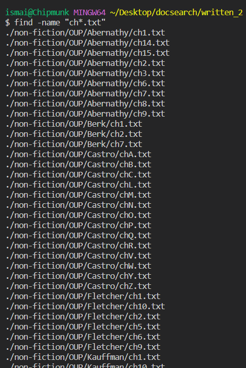

# Four ways to use the `find` command

In this lab report, I will be exploring the `find` command in bash. In addition to using the `man` command to access bash's reference manual, I have used the following resources: [[1]](https://www.redhat.com/sysadmin/linux-find-command) and [[2]](https://adamtheautomator.com/bash-find/).

## 1. `find` with `-name` or `-iname`

The first functionality we explore is using `find` to find files with a particular name or an approximate name. This could be useful when we want to find many files with similar names. Following is a sample code snippet that searches for txt files that start with "ch": 

```
find -name "ch*.txt"
```

The first example shows this on the written_2/ folder:

|  | 
|:--:| 
| *First example*

If we do not want the search to be search sensitive, we can use the `-iname` option instead. It does the same thing as `-name` except that it outputs all occurrences of the argument string regardless of the case.

```
find -iname "ch*.txt"
```

The second example below shows the bash interface for the above command. In our case it 

|  | 
|:--:| 
| *Second example*

## 2. `-type` option

Sometimes, we may only be interested in finding certain types of items in a folder. The `-type` option comes in handy here. You can use the `f` argument for searching for file types as in the first example and the `d` argument for searching for directory or folder types as in the second example.

First example:

```
find -iname "*history*.txt" -type f
```

|  | 
|:--:| 
| *First example*

Second example searching folders:

```
find -type d
```

|  | 
|:--:| 
| *Second example*

## 3. `-maxdepth` and `-mindepth` options

More often than not, you only want to search a particular folder to a certain depth. The `-maxdepth` option lets you do exactly that. Following is an example using `-maxdepth` to search `written_2/` to a maximum depth of 2:

```
find -maxdepth 2
```

|  | 
|:--:| 
| *First example*

Similarly, you may want to search files only beyond a certain depth sometimes. Analogous to `-maxdepth`, `-mindepth` lets you set the minimum depth of a particular search. The combination of these two options can help set a range of depth between which you want to search for a file. The following example searches `written_2/` between the depths of 2 and 3:

```
find -maxdepth 3 -mindepth 2
```

|  | 
|:--:| 
| *Second example*

## 4. `-ipath` option

Sometimes, you may know a fragment of the path to a file or files you are searching for. In these cases, you can use the `-ipath` option. This option is similar to the `-iname` option in that it allows you to set a format or template of the path of the files you are searching for. Following is an example of searching for files in `written_2/` that have `berlitz1/His` in their paths:

```
find -ipath "*berlitz1/his*"
```

|  | 
|:--:| 
| *First example*

In the next example, we want to search for files that are in a folder named `Abernathy` whose some parent folder is `non-fiction` : 

```
find -ipath "*non-fiction/*/Abernathy*"
```

|  | 
|:--:| 
| *Second example*
